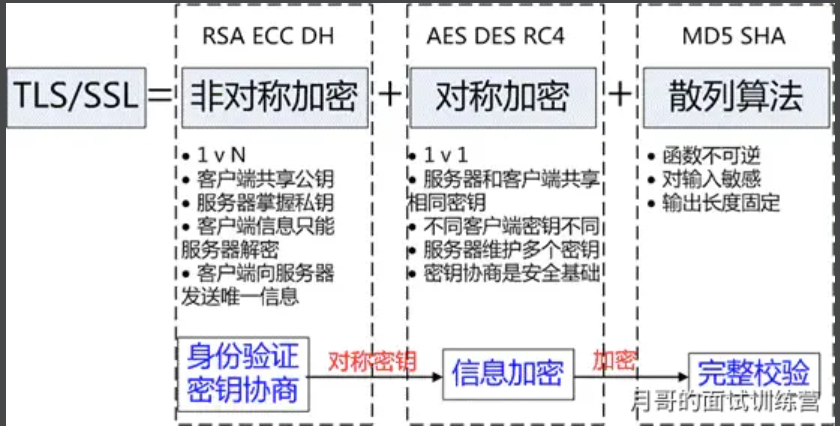

- 概念
  - TLS/SSL
    - 全称安全传输层协议（Transport Layer Security）, 是介于TCP和HTTP之间的一层安全协议，不影响原有的TCP协议和HTTP协议，所以使用HTTPS基本上不需要对HTTP页面进行太多的改造。
- 详细
  - TLS/SSL的功能实现主要依赖三类基本算法：散列函数hash、对称加密、非对称加密。
    - 这三类算法的作用如下：
      - 基于散列函数验证信息的完整性
      - 对称加密算法采用协商的秘钥对数据加密
      - 非对称加密实现身份认证和秘钥协商
    - 
  - 散列函数hash
    - 常见的散列函数有MD5、SHA1、SHA256。
    - 该函数的特点
      - 是单向不可逆，对输入数据非常敏感，输出的长度固定，任何数据的修改都会改变散列函数的结果，可以用于防止信息篡改并验证数据的完整性。
  - 对称加密
    - 对称加密的方法是，双方使用同一个秘钥对数据进行加密和解密。
    - 常见的对称加密算法有AES-CBC、DES、3DES、AES-GCM等。
      - 相同的秘钥可以用于信息的加密和解密。掌握秘钥才能获取信息，防止信息窃听，其通讯方式是一对一。
    - 特点：
      - 对称加密的优势就是信息传输使用一对一，需要共享相同的密码，密码的安全是保证信息安全的基础，服务器和N个客户端通信，需要维持N个密码记录且不能修改密码。
  - 非对称加密
    - 非对称加密的方法是，我们拥有两个秘钥，一个是公钥，一个是私钥。公钥是公开的，私钥是保密的。用私钥加密的数据，只有对应的公钥才能解密，用公钥加密的数据，只有对应的私钥才能解密。
    - 特点：
      - 非对称加密的特点就是信息一对多，服务器只需要维持一个私钥就可以和多个客户端进行通信，但服务器发出的信息能够被所有的客户端解密，且该算法的计算复杂，加密的速度慢。
    - 综合上述算法特点，TLS/SSL的工作方式就是客户端使用非对称加密与服务器进行通信，实现身份的验证并协商对称加密使用的秘钥。对称加密算法采用协商秘钥对信息以及信息摘要进行加密通信，不同节点之间采用的对称秘钥不同，从而保证信息只能通信双方获取。这样就解决了两个方法各自存在的问题。

- 注意