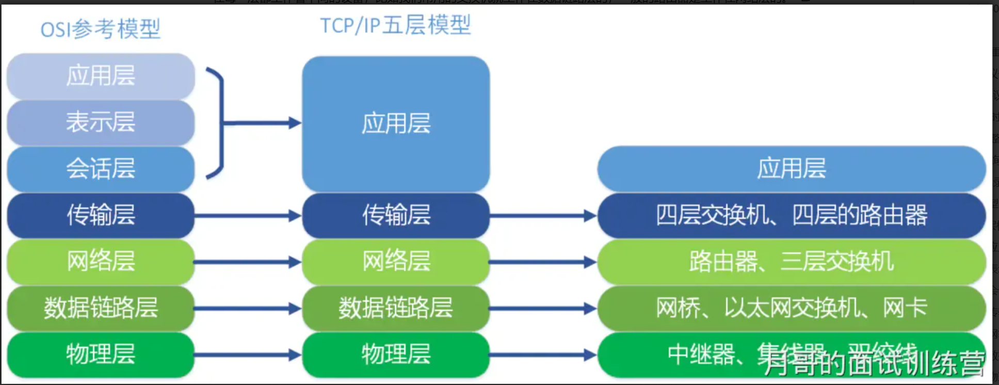
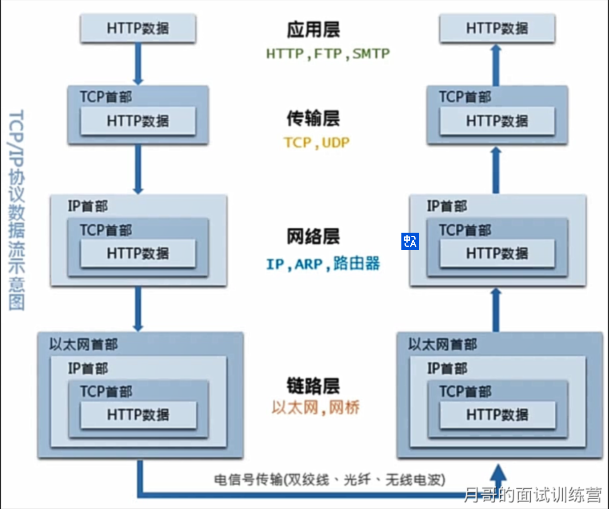

- 概念
  - 
- 详细
  - TCP/IP五层协议和OSI的七层协议对应关系如下：
    - 应用层 (application layer)：
      - 直接为应用进程提供服务。
      - 应用层协议定义的是应用进程间通讯和交互的规则，不同的应用有着不同的应用层协议，如 HTTP协议（万维网服务）、FTP协议（文件传输）、SMTP协议（电子邮件）、DNS（域名查询）等。
    - 传输层 (transport layer)：
      - 有时也译为运输层，它负责为两台主机中的进程提供通信服务。
      - 该层主要有以下两种协议：
        - 传输控制协议 (Transmission Control Protocol，TCP)：提供面向连接的、可靠的数据传输服务，数据传输的基本单位是报文段（segment）；
        - 用户数据报协议 (User Datagram Protocol，UDP)：提供无连接的、尽最大努力的数据传输服务，但不保证数据传输的可靠性，数据传输的基本单位是用户数据报。
    - 网络层 (internet layer)：
      - 有时也译为网际层，它负责为两台主机提供通信服务，并通过选择合适的路由将数据传递到目标主机。
    - 数据链路层 (data link layer)：
      - 负责将网络层交下来的 IP 数据报封装成帧，并在链路的两个相邻节点间传送帧，每一帧都包含数据和必要的控制信息（如同步信息、地址信息、差错控制等）。
    - 物理层 (physical Layer)：确保数据可以在各种物理媒介上进行传输，为数据的传输提供可靠的环境。
    - 
      - 从上图中可以看出，TCP/IP模型比OSI模型更加简洁，它把应用层/表示层/会话层全部整合为了应用层。
    - 在每一层都工作着不同的设备，比如我们常用的交换机就工作在数据链路层的，一般的路由器是工作在网络层的。
    - 在每一层实现的协议也各不同，即每一层的服务也不同
    - 同样，TCP/IP五层协议的通信方式也是对等通信
    - 
- 注意