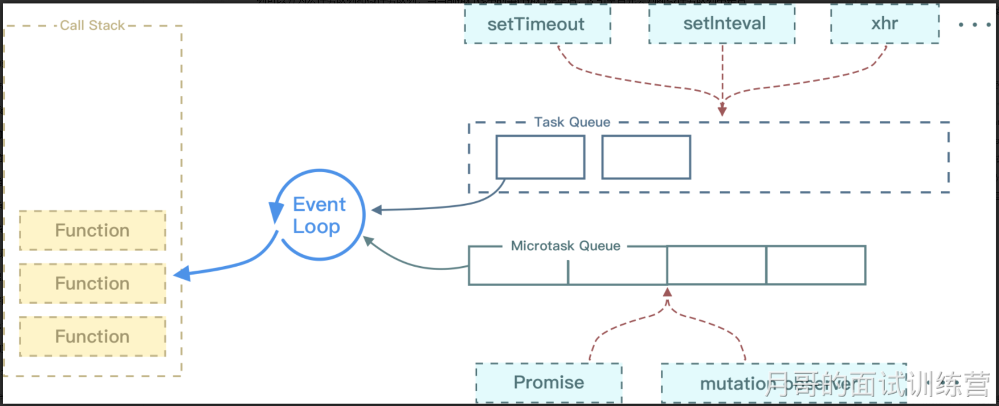

- 概念
  - 事件循环是JavaScript引擎的核心机制，它通过不断重复检查调用栈、处理异步任务、以及管理微任务和宏任务队列，确保了JavaScript在单线程模型下的高效运行。
- 详细
  - 因为 js 是单线程运行的，
  - 在代码执行时，
    - 通过将不同函数的执行上下文 压入 执行栈中 来保证代码的有序执行。
    - 在执行同步代码时，如果遇到异步事件，js 引擎并不会一直等待其返回结果，而是会将这个事件挂起，继续执行执行栈中的其他任务。
    - 当异步事件执行完毕后，再将异步事件对应的回调加入到一个任务队列中等待执行。
    - 任务队列可以 分为 宏任务队列 和 微任务队列，
      - 当当前执行栈中的事件执行完毕后，
      - js 引擎首先会判断 微任务队列中 是否有任务可以执行，
      - 如果有就将 微任务队首的事件 压入 栈中执行。
      - 当微任务队列中的任务都执行完成后再去执行宏任务队列中的任务。
  
  - Event Loop 执行顺序如下所示：
    - 首先执行同步代码，这属于宏任务
    - 当执行完所有同步代码后，执行栈为空，查询是否有异步代码需要执行
    - 执行所有微任务
    - 当执行完所有微任务后，如有必要会渲染页面
    - 然后开始下一轮 Event Loop，执行宏任务中的异步代码
- 注意